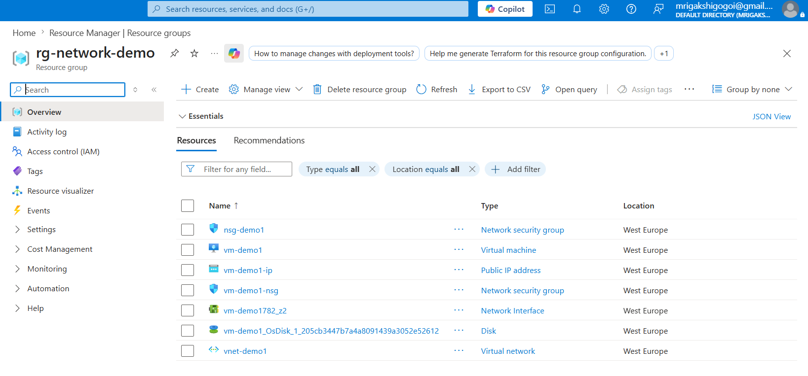
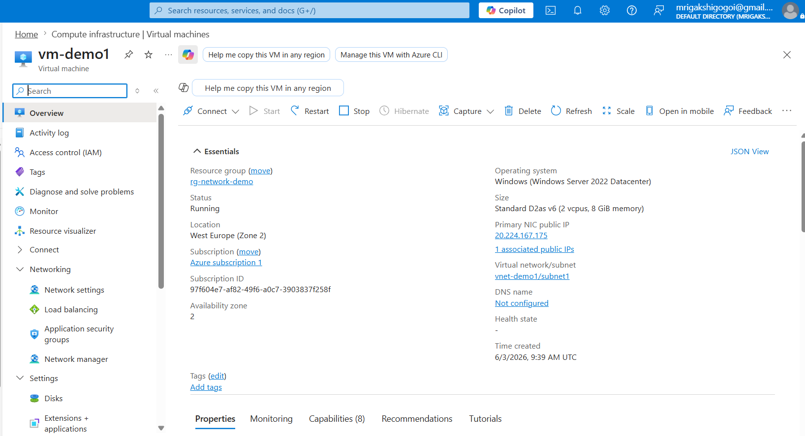
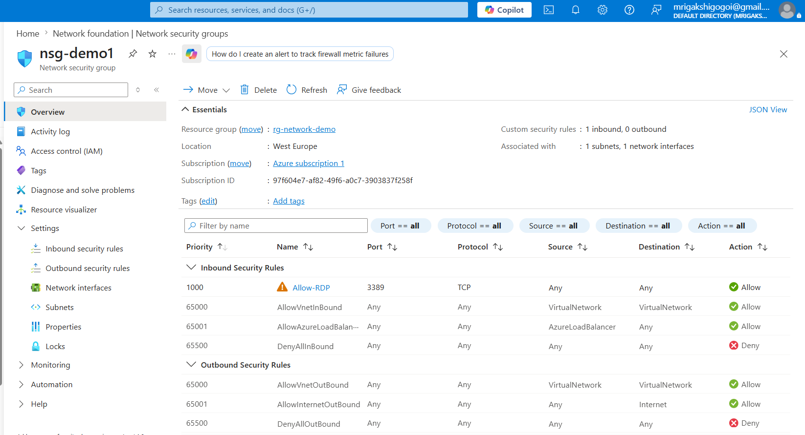
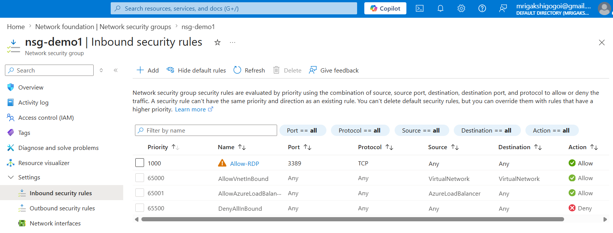
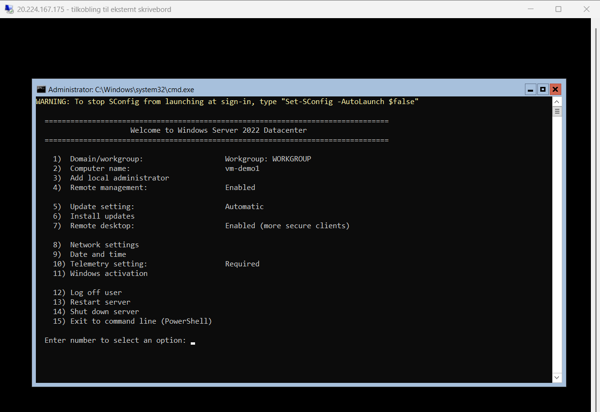

## AZ-104 Lab: Deploy and Secure an Azure Virtual Machine

## Objective

This lab demonstrates how to deploy a Windows Server 2022 virtual machine in Microsoft Azure, configure networking components, secure access using a Network Security Group (NSG), and validate connectivity using Remote Desktop Protocol (RDP).

## Architecture

Internet → Public IP → NSG → VNet → Subnet → Windows VM

## Resource Group

Created a resource group to organize all Azure resources used in this lab.

## Virtual Network

Created a Virtual Network (VNet) and subnet to host the virtual machine.

## Virtual Machine

Deployed a Windows Server 2022 Datacenter virtual machine.

## Network Security Group

Created and associated a custom NSG with the VM network interface.

## Inbound Security Rule

Configured an inbound RDP rule allowing TCP port 3389.

## Connectivity Test

Successfully connected to the VM using Remote Desktop Protocol (RDP).

## Skills Demonstrated

* Azure Resource Groups
* Azure Virtual Networks
* Azure Subnets
* Azure Virtual Machines
* Network Security Groups
* RDP Connectivity
* Azure Networking
* Infrastructure as a Service (IaaS)

## Conclusion

Successfully deployed and secured a Windows Server 2022 virtual machine in Azure. Verified network connectivity and remote administration using a custom Network Security Group and RDP access.

